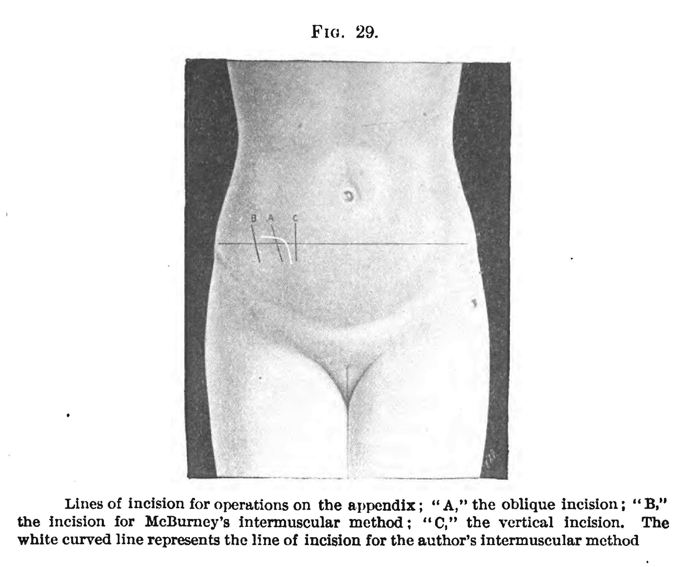
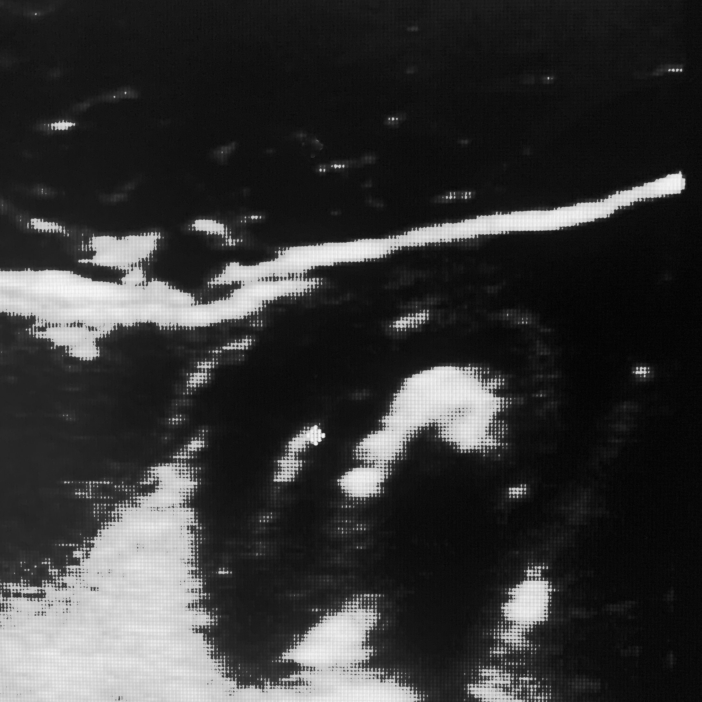
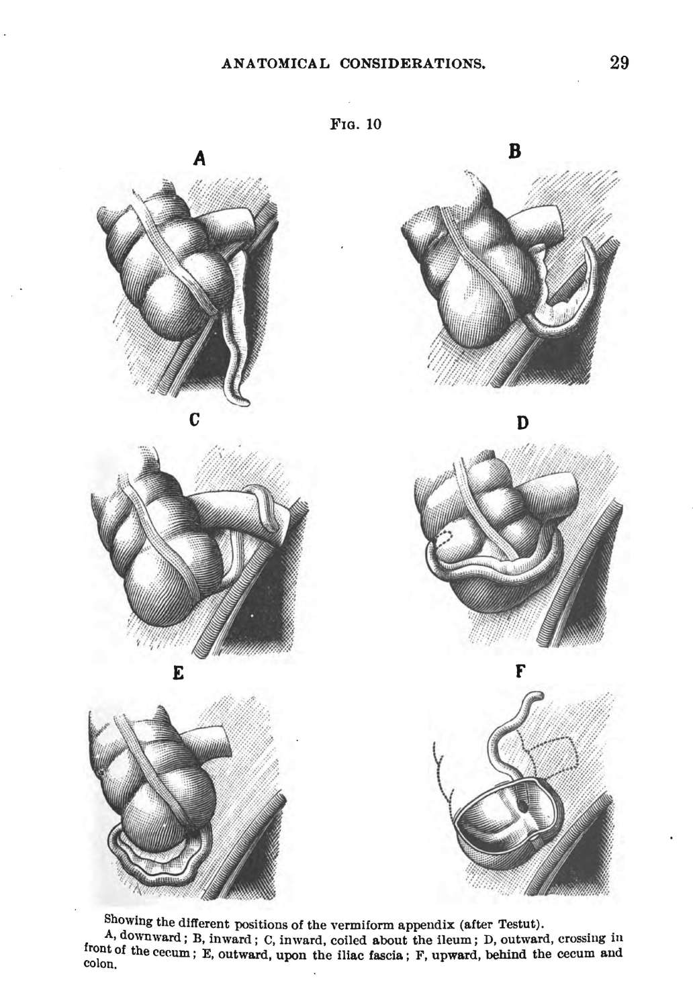

<!-- template.md -->
<link rel="stylesheet" type="text/css" href="template.css">

**

      Kornweiss Medical LLC
      Author: Steven Kornweiss, MD
      Date: 2020-11-18 14:24:21
      
   
<a href="mailto:feedback@kornweissmedical.com">Send Questions and Comments by Email Here</a>

---
**Document Title and Description:**

<!-- insert title here -->
A Physician-Patient Chronicles His Own Case of Appendicitis

What follows is an emergency physician's account of his own case of appendicitis with educational interludes, lessons learned, and finally, suggestions that may be helpful to others with the same ordeal.

---
- [History and Diagnosis](#history-and-diagnosis)
- [Treatment / Surgery](#treatment--surgery)
- [Post Operative Period](#post-operative-period)
- [My Recovery Regimen](#my-recovery-regimen)

<!-- insert body of document -->
### History and Diagnosis

On October 25, 2020, I was seated at my desk at work and noticed a vague but unusual sensation in my abdomen; a few sharp pains cascaded across my lower abdomen and then vanished. It was 10 AM. I evaluated several patients who were waiting for me, and then I ate breakfast and drank coffee.

At 11 AM, I noticed a few mild cramps in my right lower abdomen. I believed this was merely a signal to use the restroom, which I did. Immediately afterwards, I felt a right-sided, sudden, deep, and lancing pain in my pelvis that gradually faded to a dull ache. It was at this time that I believed something might be wrong.

I resumed work, but a few minutes later when I noted that the pain had not receded, I was compelled to examine my own abdomen. I laid flat on a stretcher, and pressed deeply over the right lower part of my abdomen. I encountered a small tender area between my umbilicus (belly button) and my right groin, a point known by medical professionals as "McBurney's Point." 

Fowler, George Ryerson. 1900. A Treatise on Appendicitis. J.B. Lippincott. P. 171.

I surveyed myself and noted the absence of any other symptoms. I did not have nausea, fever, a loss of appetite, or malaise. Besides the pain, which had now dulled, I felt normal. I moved my leg back and forth, walked, squatted, extended at the hip, and I felt no worsening of the pain.

I visited several patients, hoping that the pain would subside. When it didn't, I reexamined myself; the tenderness persisted. I announced my diagnosis of appendicitis to my colleagues. After each performed their own visual survey, noting my upright posture and relaxed facial expression, I was met with raised eyebrows that communicated their collective skepticism.

I worked for five more hours. The pain persisted, but it was quite mild. I felt only a vague dull ache and a sense of heaviness in the right lower part of my abdomen. I felt better when seated, and when I walked, I did not feel pain, but I noticed that I preferred to lean and bend slightly to the right. Walking, rocking back and forth, and bouncing up and down did not increase the pain as it often does in patients with appendicitis. Occasionally, I felt a lancing pain deep within my right pelvis that referred to my bladder and rectum. These shooting pains lasted only for an instant, but they were sufficiently disturbing so as to send waves of cold chills across my skin. I felt a vague sense of terror, which I quickly realized was due to my conscious fear of being ill, and from the knowledge that I might shortly be in the operating room undergoing surgery.

After performing my clinical duties, I proceeded to perform an ultrasound of my own abdomen. The moment I placed the ultrasound probe over the area of tenderness, I saw a black circle circumscribing a white circle which contained a white dome with black shadowing. 

This is a still image of my actual ultrasound.

I knew this likely represented a loop of bowel containing a hard substance all surrounded by fluid; in other words, I believed I had found an inflamed appendix harboring a stone, called an appendicolith (appendico-lith means, literally, appendix-stone -- appendicoliths typically form when stool enters the appendix and remains stuck there long enough for some hardening and calcification to occur). The appendix is a small loop, or pouch, with a dead end. This is one way it’s differentiated from other loops of bowel on ultrasound.

The appendix is labeled "Vermiform Process."

Appendicitis is a condition in which the appendix becomes inflamed, and if left untreated, can often rupture, and cause a very serious infection inside of a patient's abdomen, which can result in severe illness and even death, though in countries with modern medicine, death is extraordinarily rare even in cases of rupture. The treatment for appendicitis is usually surgical removal of the appendix. In some cases, appendicitis can be treated with antibiotics alone. As a physician, I know too well the dangers of surgery. I wanted to have as much confirmation of my diagnosis as possible before making a treatment decision.

I was able to obtain a CT scan which confirmed my diagnosis. Not only was my appendix enlarged and inflamed, there was -- as I suspected from the ultrasound -- an appendicolith within the middle of my appendix.

### Treatment / Surgery

After the diagnosis was confirmed, I decided to have my appendix removed surgically. Prior to this ordeal, I always thought that if I had appendicitis, I would choose antibiotics over surgery.  But once I confirmed that my appendix was obstructed by a stone, I decided that the risk of antibiotics failing and my appendix subsequently rupturing outweighed the risk of surgery.

If the appendix ruptures, stool and infectious material leak into the abdominal cavity, often causing an abscess to form. This usually requires hospitalization and surgical drains, as well as prolonged courses of antibiotics. It can also cause surgery to become more complicated. The healing process from the ruptured appendix can cause adhesions (a form of internal scarring) to form around the bowels, which can lead to future bowel obstructions if loops of bowel become entangled and strangulated by the adhesions. I really did not want this to happen.

On the other hand, I also did not want to lose my appendix. Most people believe that the appendix serves no known function. I remember being taught about vestigial organs in middle school. The appendix was used as an example. But, the appendix may serve a role in gastrointestinal immunity. Some believe that the appendix harbors helpful bacteria that can repopulate the colon after a bout of infectious diarrhea. The appendix is also associated with immune tissue that some believe is an integral part of gastrointestinal immunity. Additionally, at least one study has found an association between appendectomy and an increased risk of colorectal cancer, while another did not. Despite these concerns, 5-10% of Americans will undergo appendectomy every year, and these individuals seem to do quite well on the average. The last concern, which goes for any surgery, is of course the risk of surgical complications.

In my experience, most surgeons will lean heavily towards recommending surgery over antibiotics for appendicitis. Surgery is considered the definitive treatment, but there is evidence that for uncomplicated cases, antibiotics alone may be a viable treatment. It's worth discussing this with your surgeon before committing to surgery if circumstances permit.

I was brought to the pre-operative area. I reflected upon my symptoms. Where was the textbook pain of appendicitis that typically starts at the umbilicus (belly button), and which gradually migrates to the right lower quadrant? Then I recalled the prior two nights. At the time, I had thought nothing of it, but I remembered that the night before, I had been pushing on my umbilicus reflexively. Even now, I would not describe the sensation I felt as pain, just perhaps a vague and fleeting ache. I did also have a burning epigastric pain two nights prior, which I thought was acid reflux. This burning lasted an hour or two, but subsided. I've had indigestion on several occasions, but in reflection, this was more painful and sharper in quality than any prior episodes. I had awoken multiple times the two preceding nights feeling overheated and restless. At the time, all of these symptoms were mild enough that they didn’t raise any red flags in my mind. But, in retrospect, these were likely early signs that marked the beginning of the inflammatory process.

The anesthetist entered. Though surgery is performed by a surgeon, it would be far more difficult for the surgeon and the patient without the under-appreciated anesthesiologist. 

Before my operation, I met my anesthesiologist. I asked her for the anesthesia plan. I should state up front, anesthesia is complex, and a lot goes into even a simple anesthesia plan. My plan included a series of medications starting with analgesics (pain medications), antiemetics (nausea medications), and a sedative/anxiolytic (relaxation medications).

There are three major categories of analgesics:
    
**Narcotics**
        
This category includes medications like oxycodone, morphine, fentanyl and hydromorphone. My anesthesiologist was planning to use fentanyl. This drug works almost instantly after it's administered through an IV, but usually wears off within 30-120 minutes depending on the individual and the dose given.
    
**NSAIDS** (non-steroidal anti-inflammatory drugs)
        
This category includes medications like ibuprofen, naproxen, and ketorolac. My anesthesiologist was planning to use ketorolac. Ketorolac is an effective pain medicine that has no addicting properties, and does not make the patient feel sedated in any way. It also has antiinflammatory properties. It's used frequently for renal colic (the pain from kidney stones and kidney infections), and also often for gynecologic pathology, and musculoskeletal injuries.
    
**Acetaminophen**
        
Acetaminophen, or Tylenol, is often used for analgesia and as an anti-pyretic (temperature/fever reducer). In the operating room, anesthesiologists will sometimes use intravenous Tylenol to treat pain. My anesthesiologist planned to use this as well.

I was in very little pain, and I wanted to experience post-operative pain for the purposes of educating myself and others without these medications in my system. I refused all three, but I relented on the IV Tylenol. I did not take or receive any other pain medications before, during, or after my surgery besides this one dose of IV Tylenol, nor did I feel it was necessary at any time. This may not be true for others who might have varying degrees of inflammation or a different experience with pain than I did.

There are many different antiemetic drugs. My anesthesiologist wanted to use one of the most common, which is called ondansetron (Zofran). I turned this down as well, as I did not experience any nausea. Sometimes steroid medications are used to treat nausea as well, and I did agree to receive a dose of IV dexamethasone to avoid post-anesthesia nausea.

Last, it's common to receive a dose of sedative/anxiolytic such as midazolam (also known as Versed, a member of the class of medications called benzodiazepines) pre-operatively. These drugs work similarly to alcohol on a biochemical level, and similarly result in slowed thinking, slurred speech, decreased anxiety, and eventually a sedated state. I turned this down as well, as I very much wanted the full experience of being aware of and remembering the moments leading up to general anesthesia.

So, I was not the most agreeable patient. But, when a doctor has another doctor as a patient, this is expected, within reason. If you are not a medical professional, it's likely best to trust your anesthesiologist’s plan and not to request changes unless there are specific reasons.

Next, my very gracious anesthesiologist explained that I would undergo general anesthesia. This means I would be fully unconscious. There are many medications that can render a patient completely unconscious, but one of the most common is a drug familiar to those who remember [Michael Jackson's tragic death](https://en.wikipedia.org/wiki/Death_of_Michael_Jackson). This drug is called propofol. When used in proper doses under monitored circumstances, or in the context of general anesthesia when the patient will be connected to a ventilator, this is actually an incredibly safe drug with a nearly non-existent side-effect profile. The medication itself has a unique appearance. It is a milky white substance. The drug mixture has this appearance because the drug itself is lipophilic (i.e. dissolves well in fat). 

Behzad39, CC BY-SA 4.0 <https://creativecommons.org/licenses/by-sa/4.0>, via Wikimedia Commons

The drug is given through an IV line, and its ability to dissolve well in fat allows it to very rapidly cross into brain tissue and bind to receptors that render the patient unconscious (these receptors are again the same kind that are affected by drinking alcohol - GABA receptors). Depending on the dose of the drug given, the patient may continue to breathe on their own, even though they are completely unconscious. 

Next, a paralytic drug is delivered through the IV which stops the patient from moving and relaxes all of their muscles. This is very good for surgery, because it prevents the patient from moving while the surgeon is operating, but it also stops the patient from breathing by paralyzing the muscles of the thorax, including the diaphragm, which are responsible for breathing. To address this problem, and for another reason I'll explain momentarily, the anesthesiologist must connect the patient to a ventilator.

A laryngoscope (a special tool that opens the patient's airway) is used to assist with the insertion of an endotracheal tube (a plastic tube that goes inside the trachea). Once the tube is in place, it's connected to an anesthesia machine. This machine is a special ventilator which allows the anesthesiologist to control the breathing rate, depth of the breath, and the amount of oxygen going to the patient. The machine can also deliver inhaled anesthetics, which are used to keep the patient sedated throughout the procedure. The initial sedative, in my case propofol, is quickly distributed away from the brain, and then metabolized by the liver. Unless the drug is given continuously, or in repeat doses, the patient will regain consciousness within several minutes. Another reason to place a breathing tube during surgery, is to prevent the patient from aspirating their own vomitus while they're unconscious. Endotracheal tubes have special balloons that occlude the trachea, so that if the patient vomits, the lungs are protected. Without this protection, regurgitated stomach acid could be inhaled into the lungs and can cause what’s called a chemical pneumonitis (irritation and inflammation of the lungs). This can cause significant illness and even potentially death.

Dr. Lorimer, CC BY-SA 4.0 <https://creativecommons.org/licenses/by-sa/4.0>, via Wikimedia Commons

Because I didn't accept any sedatives in the pre-op area, I remember being wheeled into the OR (operating room), talking to my OR team, and breathing in oxygen and inhaled anesthetic through the mask. I remember being dosed with propofol. The next thing I remember is waking up in the post-op area. This is the goal of the anesthesiologist; to keep the patient alive and stable throughout surgery and to make sure they don't remember anything that happened. This is not easy, but experienced anesthetists certainly make it look easy.

In the emergency department, we use similar medications for bedside procedures, but we must be cautious with our dosing, because we do not endeavor to connect our patients to ventilators. So, we must dose medications adequately to ensure patient comfort, but not to the degree that they cease to breathe unassisted.

While I was sedated, my surgeon had carried out a laparoscopic appendectomy.

He first made an incision on my abdominal wall just beneath my umbilicus. He then dissected down through the fat until he reached the peritoneum (this is a layer of tissue that encloses the abdominal cavity and all of the organs inside).

The blue shaded area is representing the peritoneal covering of the abdominal cavity.

Usually, the surgeon will lift upward on the peritoneum and make a tiny incision, large enough to insert a hollow plastic tube, called a port. Through the port he can insert a camera, and a machine that insufflates (inflates) the abdominal cavity with air. The abdomen inflates upwards like a balloon, making space between the abdominal wall and the bowels and organs so that the surgeon can insert tools and have space to work. Two more holes are made in the abdominal wall for a total of three. This makes room for a camera and two tools. Usually, an assistant manages the camera while the surgeon operates the tools.

Dalass 1988, CC BY-SA 4.0 <https://creativecommons.org/licenses/by-sa/4.0>, via Wikimedia Commons

Blunt graspers are used to move the bowels in order to expose the appendix, which in my case was anterior, superficial, pointing downwards and located within the peritoneum - closest to letter A below.

Fowler, George Ryerson. 1900. A Treatise on Appendicitis. J.B. Lippincott. P. 29

Once the appendix is located, the surgeon still has to separate it from any adjacent loops of bowel and connective tissue by cauterizing (burning) and pulling it away. Once the appendix is fully dissected and separated from other tissues, it can be cut away from the bowel. This can be done in numerous ways, but it is now most commonly done using a tool that cauterizes the bowel and delivers a line of special staples across the base of the appendix. This simultaneously separates the appendix from the bowel and closes the remaining appendiceal stump all at once.

Then, the appendix is removed through one of the three ports, the abdomen is deflated, the ports are removed, the tiny incisions (each about an inch long) are closed with suture and glue, and the surgery is concluded.

As the procedure is nearing its end, the surgeon will notify the anesthetist who will turn off the inhaled anesthetic and administer an IV drug to reverse the paralysis. Once the patient is breathing on their own, the anesthetist will remove the breathing tube. This is an extremely important and delicate process that anesthetists do routinely, but which is not to be taken for granted. If the tube is removed too early, the patient may not yet be breathing on their own, too late and the patient may experience significant discomfort.

Once the patient is extubated (breathing tube is removed) they are brought to the post-op area where nurses will monitor the patient until they have been stable for 30-60 minutes.

In my case, I went home after this monitoring period. I was mildly sore, but completely lucid, and felt very well rested.

### Post Operative Period

Let me say at the outset, as an emergency physician, I tend to worry about worst case scenarios. I did worry frequently, especially during my second postoperative week, that something was wrong. My postoperative course has been uneventful thus far (I am now over three weeks out as I write this).  My expectations that I would feel completely recovered within a few days were simply unrealistic.

**Week 1**

On postoperative day one, my abdomen was significantly distended (bloated) to the point of feeling taut. I did not have a lot of pain, but I felt very uncomfortably bloated. I could not wear any of my usual clothing. Sitting up and down was difficult. I had to use my arms to push myself up from a seated position. Instinctively, I did not want to attempt any abdominal contraction. I had little appetite, and I had to remind myself to eat small amounts of food (I'll give details below) and to drink water with stool softener. I did have pain underneath my right trapezius muscle (my right shoulder), which is referred pain from distension and subdiaphragmatic air from surgery. This subsided by the beginning of day two.

Day two was similar to day one. I slept a lot, and watched a lot of television. I attempted to read and write, but I was both mentally and physically exhausted, and succumbed to exhaustion within minutes of opening my computer. Despite the exhaustion, I did wrest myself from the couch for 30-40 minutes to walk each day.

On day three, I was able to eat a bit more, and bowel function returned.

I checked my incisions every day for signs of infection, like worsening pain, redness, or tenderness. I took pictures of them daily so that I could compare one day to the next. I actually used these pictures on day six when I had increased pain at one incision and I thought its color had reddened, but when I compared it to the pictures from all prior days, it actually looked improved.

My incisions were closed at the skin with glue, so there were no visible sutures. The incisions were firm to the touch, tender, purple and yellow from bruising. As the bruising diminished, the color became a pale yellow, and then finally normal skin color. These color changes are caused by [heme degradation](https://en.wikipedia.org/wiki/Bruise#Mechanism). The incision around my umbilicus was especially swollen and the surrounding skin was firm in an area the size of my palm. This improved very gradually over two weeks.

I did not take any medication at all. I chose to avoid NSAIDs like ibuprofen because there is both mechanistic evidence and data from animal studies showing that NSAIDs may slow wound healing, and can slow healing of bowel anastomoses. This may be more relevant for more significant bowel surgeries, but I wanted every chance to optimize healing.

Meanwhile, a pathologist had examined my appendix. It's routine for the surgeon to send surgical specimens for examination. There are several reasons for doing this. In cases of appendicitis, it's important both to confirm the diagnosis, and to look for other diagnoses such as appendiceal cancers, which occur from time to time. Pathologists are specially trained doctors who examine biopsies (tissue samples) and who also perform whole autopsies to find out what is (or was) wrong. The pathologist determined that I definitely had appendicitis. This determination was made by looking at the appendix with the naked eye, and by examining thin slices of the appendix under a microscope.

**Week 2**

By day eight, I was able to work. However, my abdomen still felt slightly swollen and heavy, and I had sharp pains deep within my pelvis every one or two hours that were similar to the pains I had before surgery. While disturbing, and worrisome, these pains were intermittent, and I felt better overall. I did not have any fevers, nausea, vomiting, or worsening pain. This improved a little bit each day.

I was worried on day ten when I continued to have right lower quadrant pains and tenderness, so I visited my primary doctor for an evaluation. He examined me and agreed that I was in fact still quite tender. He ordered labs which included a CBC and a CRP (c-reactive protein - a very sensitive marker of inflammation). We also ran a urinalysis and a liver function panel. All labs were completely normal, with an incredibly low CRP of 0.01, which is the lowest possible value. With a value this low, the chance of an ongoing infection or surgical complication is incredibly low. This data, combined with my improving symptoms, was reassuring.

**Week 3**

During week three, my symptoms were 95% resolved. The glue holding my incisions closed had naturally fallen off. There was still firmness around the incisions, but only in the immediate vicinity, and it was not painful to the touch. During the third week, I felt as though I was nearing complete recovery from surgery. I had to remind myself not to perform any unnecessarily strenuous activities though, because internal connective tissues in the abdominal wall can take even longer to heal - perhaps six to eight weeks.

### My Recovery Regimen

There are a few trite recommendations that you'll hear doctors enumerate for nearly every condition. They're also the same things you'll hear from your family and friends. These recommendations are so general and commonplace, that they're often under-weighted or ignored completely, but they shouldn't be.

How many times have you been told to "get plenty of rest, drink lots of water, and be active, but not too active?"

Because this advice is repeated so often, and is usually unquantified, it sounds unsophisticated, but it is crucial.

**Sleep**
I did sleep a lot. I slept more than fourteen hours the first day after surgery, and twelve hours the next. I slept at least eight hours a night for the next two or three days after that. I didn't aim to sleep any particular amount, but I did not limit my sleep the way I often do with imposed schedules and alarms. It’s normal to need this much sleep after surgery. Sleep is one way that metabolic resources can be rerouted to the immune system and gastrointestinal system for fighting infection, inflammation, and repairing damaged tissue. Additionally, some anesthesia medications can take days to completely clear the system, and until they do, may contribute somewhat to a relative sense of fatigue.

**Hydration**
I hydrated by drinking enough to produce clear light-yellow urine every 2-4 hours while awake. If frequency decreased, or the urine darkened, I drank more. Hydrating cannot be done with just plain water, especially when you are not eating sufficient food and electrolytes, which is common during illness or after surgery. Hydration is best achieved with adequate salt (sodium-chloride) intake. Other electrolytes like potassium and magnesium can be helpful as well. There are many excellent [oral rehydration solutions](https://amzn.to/36Daw8K) and mixes on the market - I prefer those without added sugar.

**Activity**
It's extremely important to walk after surgery. I really didn't feel like getting off of the couch, but I forced myself to walk 30-60 minutes per day anyway. Walking helps recover bowel function, decreases the risk of developing blood clots and pneumonia, and can prevent a decline in cardiopulmonary fitness. I was shocked by my degree of exhaustion and how quickly I became de-trained after surgery. During the first week, I felt exhausted after just 20-30 minutes of walking at a slow pace, but my endurance gradually improved. I believe I benefited from walking regularly and increasingly as my improvement allowed.

If you've had surgery, you'll know that you are usually given certain lifting and movement restrictions. I was restricted to lifting five pounds for the first two weeks and then allowed a gradual increase in weight on a weekly basis until unrestricted lifting and movement is allowed eight weeks postop. These restrictions are not arbitrary.  They are to prevent weakened tissues in the abdominal wall from tearing, which could result in an abdominal wall hernia. Following these restrictions to the letter is prudent if you are to avoid repeat surgery.

**Nutrition**
I focused on avoiding sugar of all kinds and processed foods to reduce hyperglycemia and oxidative stress that might slow wound healing and increase the risk of infections. 

Instead I focused on eating nutrient-dense whole foods like eggs, meat, fish, vegetables, avocado, and a little bit of fruit (I choose berries like blueberries, blackberries, and raspberries, which have relatively little sugar compared to fruits like apples, bananas, strawberries, and melons). Broth --particularly bone broth made from real bones and connective tissue -- is one of my staples even when I am healthy. It’s possible that the particular mix of amino acids in broths favors the development of healthy connective tissue, which is exactly what your body needs to regenerate after surgery.

**Bowel Regimen**
My surgeon recommended Miralax (polyethylene glycol), which is an osmotic laxative. It's an inert substance that passes through the bowel unabsorbed. As it passes through the colon, it binds to water and holds that water in the colon, which might otherwise have been absorbed. This action of maintaining more water in the colon keeps stool soft and makes it easier to move the bowels. The importance of this both from a standpoint of recovery and comfort cannot be emphasized enough. I drank 20 ounces of water with a cap full (17 grams) of [Miralax](https://amzn.to/3pLe3uy) each morning and each evening. This worked beautifully.

I will also take this opportunity to recommend a product called the [Squatty Potty](https://amzn.to/32OBPvy), which is a special stool that helps put you in a proper position on the toilet. The squat position is essential for reducing the "anal angle" to reduce straining, which is both painful and potentially dangerous in the postoperative period.

---

Website: <https://kornweissmedical.com>

---
**Disclaimer:**

This document is intended for distribution to clients(patients) of Kornweiss Medical LLC.

If you are not a client(patient), and you are in receipt of this document, please disregard any medical advice contained herein. Your receipt and/or reading of this document does not constitute a doctor/patient relationship. The use of this information and the materials herein is at the user's own risk. The content of this document is not a substitute for professional medical advice, diagnosis, or treatment. Users should seek professional medical advice for any symptoms or medical conditions they may have.