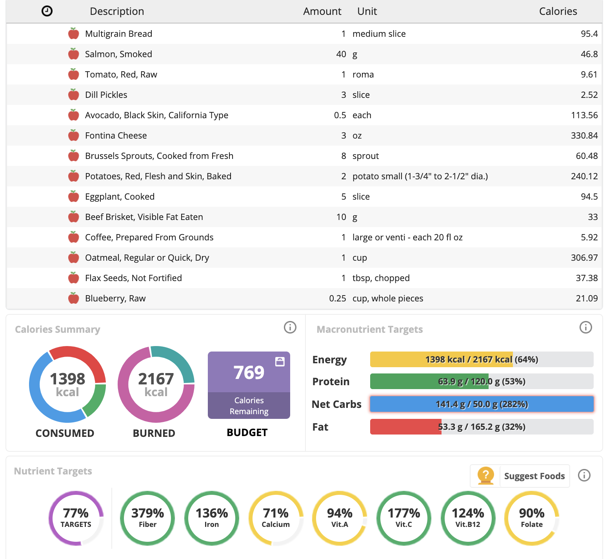

<!-- approach_to_nutrition.md -->
<link rel="stylesheet" type="text/css" href="template.css">

      Kornweiss Medical LLC
      Author: Steven Kornweiss, MD
      Date: 2020-04-18
      
   
<a href="mailto:feedback@kornweissmedical.com">Send Questions and Comments by E-mail Here</a>

---
**Document Title and Description:**
My Approach to Nutrition

---
**Table of Contents:**
<!-- insert table of contents -->
- [Define Your Goal and its Purpose](#define-your-goal-and-its-purpose)
- [Evaluate Your Purpose](#evaluate-your-purpose)
- [Assess Your Position](#assess-your-position)
- [Estimate Your Requirements](#estimate-your-requirements)
- [Eliminate the Unnecessary and the Harmful](#eliminate-the-unnecessary-and-the-harmful)
- [Add the Essential](#add-the-essential)
- [Iterate](#iterate)
- [Monitor for Mistakes](#monitor-for-mistakes)
- [Judge Your Mistakes](#judge-your-mistakes)
- [Avoid Guilt and Improve](#avoid-guilt-and-improve)
- [Don't Conflate Celebrating with Cheating](#dont-conflate-celebrating-with-cheating)
- [Increasing Precision](#increasing-precision)
- [Useful Frameworks](#useful-frameworks)
---
<!-- insert body of document -->
# Define Your Goal and its Purpose
*Before you can formulate a plan, you must define your goal and its purpose.*

- Clearly identify your goal, preferentially in writing.
  > "I want to gain 10 pounds of muscle and lose 5 pounds of fat."

- Next, identify the purpose(s) of your goal. This is the *reason* for pursuing your goal.
  > "I want to achieve my goal so that I can look better, feel better, and live longer."

# Evaluate Your Purpose
*Make sure that your purpose is rational, selfish, attainable, and non-contradictory*

**Rational**

Your purpose has to be based in reality, and must come from some underlying fact of your life. In the above example, the source of the purpose is the fact that humans require healthy lean bodies to feel good and to maximize life span. The fact of looking "good," suggests that the body has a purpose, and the closer the body comes to serving that purpose (providing the inhabitant with a strong and mobile structure to carry out it's will), the "better" it looks. The "norms" of appearance aren't arbitrary, they arise from the physical traits that cause health, ability, and longevity.

Compare the given purpose, to a different purpose: "I want to gain muscle and lose fat so that other people think I look good." In this example, the purpose is derived from the subjective whim of an onlooker. You cannot depend on the judgment of others; their approval or disapproval has no bearing on your actual wellbeing, health, strength, or longevity.

**Selfish**

I've already hinted at this in the previous section. Look at the first purpose - to be strong, to look good, to live long - for yourself. Compare this to the second: to look good to others. The first is selfish -- that is, it serves your own self interest, not at the expense of others, just to the benefit of yourself. You judge your achievement based on how you feel, how you look, how vigorously you can live.

Contrast this with the second-handed purpose of wanting to look good for someone else. This view holds the other person's approval as the measure of success, rather than your own wellbeing. If this were your type of purpose, the only achievement you could ever have would be to gain the approval of others. If they wish to see you succeed objectively, they may judge you justly; but if they have a perverted system of values, they may judge you unjustly. You might gain their approval at the expense of your own body, your own health, your own life. Besides, you can never truly know what someone else is thinking, so holding another's approval as your measure of achievement relegates you to an endless process of suspicion and self-doubt. 

**Attainable**

You can not set out to achieve a goal for which there is no evidence of attainability. If you set an arbitrary goal, say, to gain 50 pounds of muscle, you fail instantly before even starting. You must set a goal that is not trivial, but that you at least have some evidence to suggest is attainable. If you've only gained 1 or 2 pounds of muscle in the past, an attainable goal might be to gain 3. Setting an unattainable goal is an instant destroyer of motivation. It ensures that you will not have even a single iteration of success, and even a significant improvement may be misinterpreted by you as a failure.

**Non-Contradictory and Non-Sacrificial**

Your goal and/or purpose cannot be undertaken at the expense of a higher goal or value. If your goal is to gain 20 pounds of muscle, and you think this is attainable, but only through twice-a-day workouts and spending hours on nutrition daily, but your other higher goals are to raise a family and to further your career - then undertaking this goal amounts to the destruction of your highest values.

# Assess Your Position
*Discover your current status and how it relates to your purpose*

The easiest way to take stock of your current nutrition is to accurately record your current intake. Fortunately, this is easy to do with an app called *[Cronometer](https://cronometer.com/)*.

This mobile app, or the web based version, enables you to enter a whole food, packaged food, supplement, and even some restaurant foods, and a serving size. Once this information has been entered, Cronometer will keep track of your macro and micronutrients. At the end of the day (or at any time, really), you can review the dashboard and see what your intake has been.

Today (4/20/20) I ate when I felt like eating, and I ate whatever I wanted to. I did keep track of the amount of food I was eating - either in serving sizes like "slices" or "ounces," but I didn't try to restrict my intake in any fashion. I wasn't paying too much attention to my nutrition today, so I really wasn't sure how the log would come out. Let's take a look:

**First, let's look at total caloric intake:**

So far I've only eaten just about 1400 calories. I'd have guessed higher than this. I've been a bit tired though, and haven't worked out in a few days. My appetite is lower than usual, so this makes sense.

**Next, look at my protein intake:** 

63.9 grams! This is surprising. For general maintenance, 1g/kg of body weight is probably adequate for most people. I am almost exactly 70 kg, so my protein intake is almost spot on for maintenance. I

# Estimate Your Requirements
*Make an initial estimate of what you require to reach your goal*

# Eliminate the Unnecessary and the Harmful
*Whatever doesn't serve your purpose should be eliminated*

# Add the Essential
*Add anything that's missing from your requirements*

# Iterate
*Cycle through the previous steps regularly, making improvements each time*

# Monitor for Mistakes
*Constantly monitor yourself for mistakes, and identify them clearly*

# Judge Your Mistakes
*Evaluate your mistakes honestly and objectively*

# Avoid Guilt and Improve
*A mistake is not grounds for guilt; as long as you are trying, it's merely an opportunity to improve*

# Don't Conflate Celebrating with Cheating
*A big nutrition pitfall is to normalize cheating; instead celebrate rationally*

# Increasing Precision
*When possible, use better measurements to quantify your efforts*

# Useful Frameworks
*Learn frameworks, skills, techniques, to help execute your plan*

---

### [References](https://www.zotero.org/groups/2437331/kornweiss_medical)

Website: <https://kornweissmedical.com>

---
**Disclaimer:**

This document is intended for distribution to clients(patients) of Kornweiss Medical LLC.

If you are not a client(patient), and you are in receipt of this document, please disregard any medical advice contained herein. Your receipt and/or reading of this document does not constitute a doctor/patient relationship. The use of this information and the materials herein is at the user's own risk. The content of this document is not a substitute for professional medical advice, diagnosis, or treatment. Users should seek professional medical advice for any symptoms or medical conditions they may have.