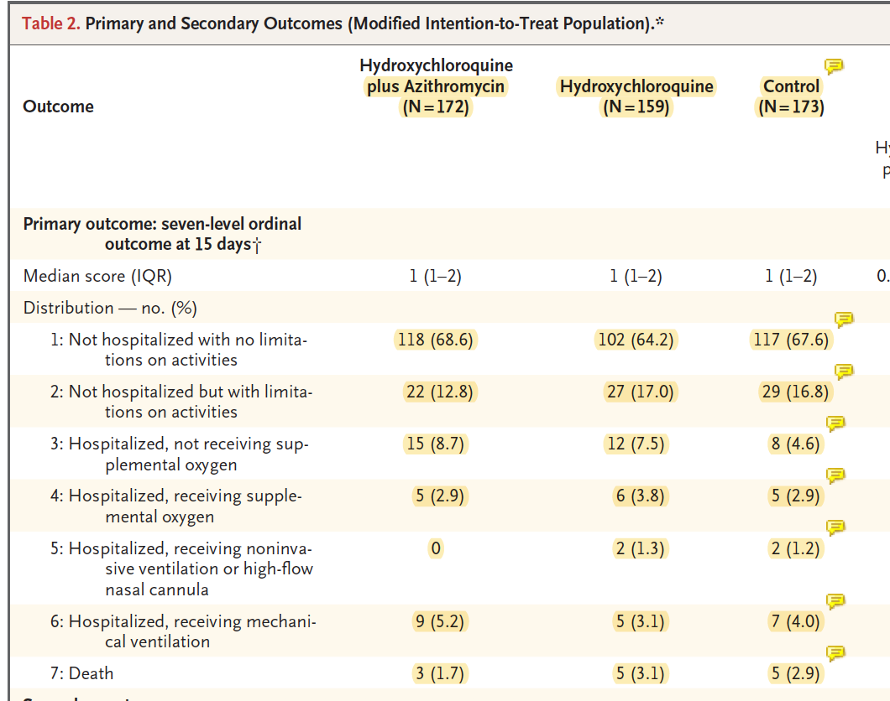
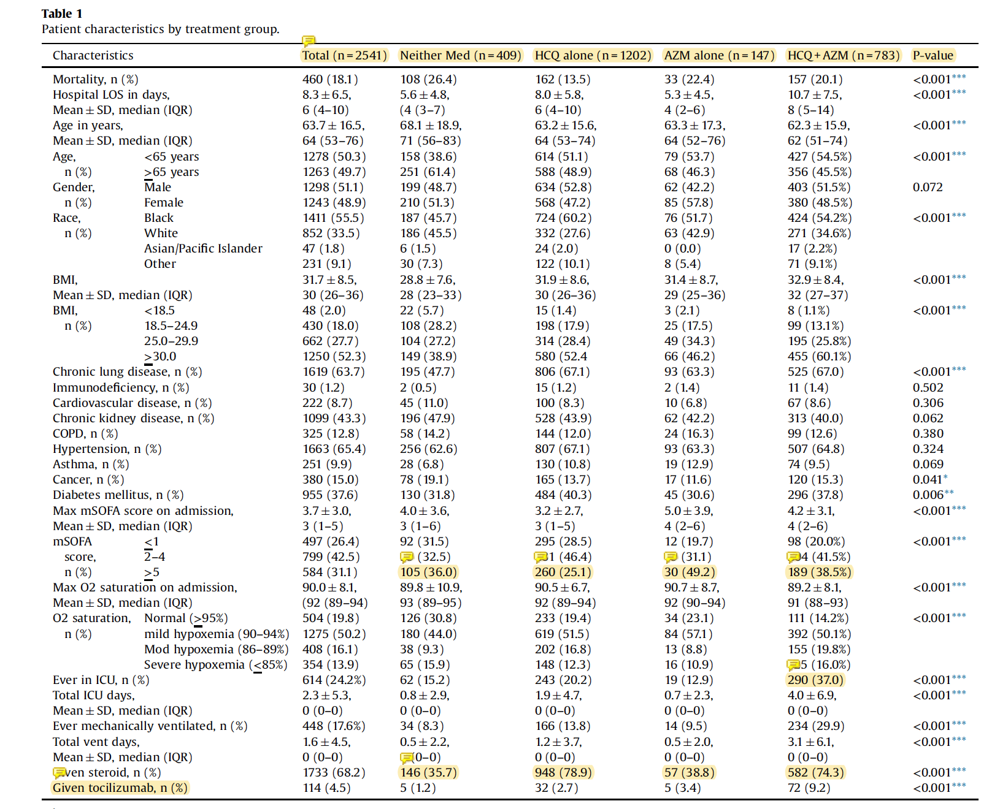

<!-- header -->
# Hydroxychloroquine, Zinc, and a new Nutrition Article
<!-- topics -->
## Contents

- Hydroxychloroquine is the hot topic that won't go away.
- Zinc - Is it required for hydroxychloroquine to work?
- Read my new nutrition article on calculating macronutrient requirements.

<!-- link to website content -->
- [Why and How to Calculate your Macronutrient Requirements](https://kornweissmedical.com/why-and-how-to-calculate-macronutrient-requirements/)

# Preview...

<!-- header of preview 1--> 
# Hydroxychloroquine and Zinc

**Hydroxychloroquine is the hot topic that won't go away.**

In the past 2 weeks, HCQ is back in the news. It's easy to see how it has become a political issue, and I feel compassion for anyone who doesn't know what to make of the situation.

After a careful review of the three most recent high-impact studies on HCQ for CoViD-19, my opinion is that I would not currently take the drug myself, nor recommend it to friends, family, or patients in the event that they were exposed to or contracted SARS-CoV-2 (the virus that causes CoViD-19). All of the existing evidence suggests that the drug does not help in any way, and that the drug has a non-trivial rate of significant side effects including, most commonly, diarrhea (~15%) and less-commonly, but more significantly, cardiac arrhythmias (~1-2% or less). Based on existing evidence, my position holds true even when the drug is used in combination with Azithromycin and/or Zinc.

I would gladly change my opinion if new or more specific evidence came to light.

Here are the three articles that I recently analyzed to reach my current conclusion:

## A Randomized Trial of Hydroxychloroquine as Postexposure Prophylaxis for Covid-19
   
[This study](https://doi.org/10.1056/NEJMoa2016638) examined HCQ as prophylaxis in high-risk exposures to SARS-CoV-2. 11.8% (49/414) of the group receiving HCQ contracted CoViD-19 compared to 14.3% (58/407) of the placebo group. This is a small gap in favor of HCQ but doesn't remotely approach statistical significance (p=0.35). My conclusion of this study is that it's very unlikely HCQ will prevent you from contracting CoViD-19 even if you know you were exposed and start taking the drug right away. I think the big takeaway here, though, is that only 10-15% of people with high or moderate-risk exposures contracted the disease.

   >*Definition*: High or moderate Risk Exposure was defined as "adults who had household or occupational exposure to someone with confirmed Covid-19 at a distance of less than 6 ft for more than 10 minutes while wearing neither a face mask nor an eye shield (high-risk exposure) or while wearing a face mask but no eye shield (moderate-risk exposure)"

**What about Zinc?**

Some people think that HCQ will only work as prophylaxis (or treatment) if given with zinc. They believe that HCQ works as a "zinc ionophore" (an ionophore is a substance which is able to transport ions across a lipid membrane into a cell). Essentially, some people think that HCQ helps zinc get into the cell, and then, either zinc alone, or HCQ and zinc together can disable the virus in some way. To my knowledge, there hasn't been a great study using zinc and HCQ together as prophylaxis, but, Chris Masterjohn, PhD, a biochemist, wrote [this article](https://chrismasterjohnphd.com/covid-19/are-chloroquine-and-hydroxychloroquine-zinc-ionophores-covid-19-updates) explaining why he doesn't believe that this is a plausible mechanism for zinc's antiviral activity. I don't have the expertise to analyze this other than to say that Chris's analysis makes sense to me based on my knowledge of biochemistry.

## Hydroxychloroquine with or without Azithromycin in Mild-to-Moderate Covid-19 | NEJM
   
   [This study](https://www.nejm.org/doi/10.1056/NEJMoa2019014) examined HCQ as treatment for mild-moderate CoViD-19 disease. Patients were randomized either to standard care, standard care + HCQ or standard care + HCQ+Azithro. Standard care was determined by the treating clinician, which is an important fact that I'll discuss below. Here are the key outcomes data:

You can see the numbers for yourself in this table. The numbers are looking really similar on every level - number of people in the hospital, requiring oxygen, on ventilators, deceased, etc. 

**Other Treatments Used in This Study**

It's important to know the other treatments that the patients were receiving in each group. You can see those data [here](https://www.nejm.org/doi/suppl/10.1056/NEJMoa2019014/suppl_file/nejmoa2019014_appendix.pdf) in the supplementary appendix for the study. No patients in this study were treated with Remdesevir, a small but equal number were treated with steroids, (about 10 in each of the 3 groups of approximately 150 patients). Most of the other treatments used were antibiotics, likely given for suspected or confirmed concurrent bacterial infections (most commonly pneumonia).

**Shortcomings**

One possible shortcoming to this study is the time period of 15 days. It looks like most patients were sick for a week or so before being enrolled in the study, which gives about 3 weeks of total time to see outcomes, but at the study's conclusion, there were still ~25 patients in each group who were still hospitalized.

The other shortcoming is that "standard care" was determined by the treating physician. We can't tell from the manuscript how else care might have differed between physicians, areas of the hospital, etc.

**Conclusion**

Overall, I think this study is high-quality evidence suggesting that HCQ is unlikely to be helpful in mild-moderate disease.

## Treatment with hydroxychloroquine, azithromycin, and combination in patients hospitalized with COVID-19

This paper was based on data analysis of patients who were hospitalized at the Henry Ford hospital system in Detroit form March 10, 2020 to May 2, 2020. The patients were all treated based on the physician's discretion, and then, after the fact, they were grouped into four groups.

1. Neither medication
2. HCQ
3. Azithromycin
4. HCQ+Azithromycin

They found a huge mortality benefit in the groups who received HCQ. For the most stark comparison, the HCQ group had a 13.5% mortality rate (162/1202) vs. the neither medication group which had a mortality rate of 26.4% (108/409). The other two groups followed the same trend, but had a less impressive difference.  See the table here:

But, don't get too excited. This study is seriously problematic.

The major problem with this study is at the bottom of the chart (see my highlights). Look at the two HCQ groups. Three-quarters (75%) of the HCQ groups received steroids whereas only 1/3 of the other groups received steroids. Similarly, the rate of administration of tocilizumab (an IL-6 inhibitor) to the HCQ groups was much higher.

So, it's impossible to tell which drug, or combination of drugs was helping or hurting here.

But, the huge difference in treatments between the groups is actually interesting for a hidden reason. It is an indicator that these patients were different in some fundamental way. The reason for massive differences in treatments is much more likely to be explained by patient prognosis, individual characteristics, location in the hospital, location in the hospital system (there are 6 possible hospitals), the treating physician, and many other possible factors which we'll never know.

The bottom line is that this study epitomizes the problems with a retrospective non-randomized uncontrolled study. There is no way to tell how these patients arrived in their respective treatment groups. We just can't tell anything from this study in terms of which drugs may or may not have been effective.

If you want a marked up PDF with my highlights and comments on this study which draws attention to the high points and problems, go [here](/content/docs/references/Arshad%20et%20al.%20-%202020%20-%20Treatment%20with%20hydroxychloroquine,%20azithromycin,%20a.pdf).

## Bottom Line on HCQ

Figuring out which drugs work for a disease like CoViD-19, which has a wide range of severities and manifestations is a complex business. Listening to politicians and main-stream news-media on this topic (and probably most others) is going to get your head turned around. My recommendation is to do independent research, but to stick to the highest quality resources you can find. These include:

1. Intellectually honest physicians and scientists with careful nuanced viewpoints like Chris Masterjohn, Eric Topol, Peter Attia, Amesh Adalja, and Trevor Bedford. They can all be found on social media.

[This article](https://leapsmag.com/the-only-hydroxychloroquine-story-you-need-to-read/) on HCQ by Amesh Adalja, MD is particularly salient.
   
2. Go to the primary sources and read them yourself. Most of these articles can be found in their full-text on Google Scholar. They might take longer to read than a news article, but you'll at least have some idea of what's going on in the actual study. I believe that at least 75% of what's done in these studies can be understood by someone with a high-school science education.

<!-- header of preview 2--> 
# Why and How to Calculate your Macronutrient Requirements

<!-- content of preview 2-->

How can we know what to eat?

We could rely on intuition. But, many people have realized, myself included, that the modern food environment has disrupted this approach. It has been repeatedly argued, most recently and thoroughly (in my opinion) by Stephan Guyenet, Ph.D, that in the modern food environment, our intuition, our hunger and cravings, often betray us. This is not true for everyone. Some people have well regulated and healthy metabolisms and do very well by listening to their internal cues. But, some people have limited success when they follow their internal cues, and many others are high performers who want to gain every advantage they can find from nutrition.

For these people, another approach is possible. This approach is to try to understand which substances the human body and mind requires to function and thrive, and then to figure out how to get these substances from food.

[Click here](https://kornweissmedical.com/why-and-how-to-calculate-macronutrient-requirements/) to read the whole post.

<!-- home health devices -->
# Home Health Devices

I have been recommending that all of my family, friends, and clients obtain at least a few home health devices. It's very valuable to be able to call your physician and to give them a full set of vital signs. In order to do this, you need a thermometer, blood pressure cuff, and a pulse-oximeter. These are inexpensive and easy to operate. To make it easier and to save you time, I've put together [this webpage](https://kornweissmedical.com/devices/) which is a list of the products that I have personally researched, purchased, and used.

<!-- my medical practice -->
# My Medical Practice

I run a private medical practice in South Carolina, but in this age of virtual everything, I am working on expanding to other states. If you're interested in a consultation or in becoming a member, please send me an email at [contact@kornweissmedical.com](mailto:contact@kornweissmedical.com) or fill out [this form](https://kornweissmedical.com/schedule-a-consultation/) on my website.

To learn more about my practice and what I do - [go here](https://kornweissmedical.com/about/).

-Steve